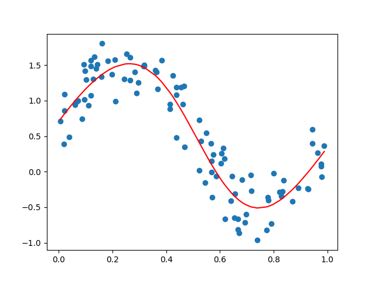
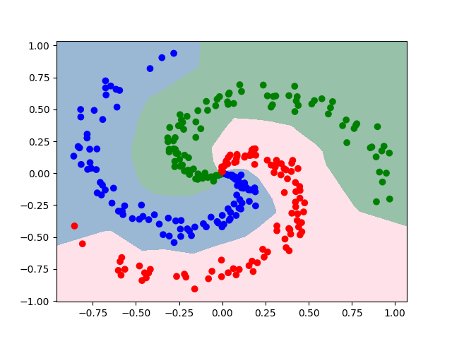

# NNet 2.0
NNet 2.0 - A simple neural network library mimicking pytorch interface.

## Example Codes
### Linear Regression
Test of linear regression

Source code: [test_linear_layer.py](test_linear_layer.py)



### Multiple Layer Perceptron (MLP)

Multiple Layer Perceptron (MLP) for classifying spiral data.

Source code: [test_mlp_spiral.py](test_mlp_spiral.py)



### Convolutional Neural Network (CNN)
Convolutional Neural Network (CNN) based MNIST classifier.

Source code: [test_mnist_cnn.py](test_mnist_cnn.py)

Test result after 5 epochs with batch size of 500.
```
epoch 0 - 19.20 sec
    train loss: 0.5993, accuracy: 0.8120
    test loss: 0.1200, accuracy: 0.9601
epoch 1 - 15.76 sec
    train loss: 0.1206, accuracy: 0.9625
    test loss: 0.0611, accuracy: 0.9801
epoch 2 - 15.83 sec
    train loss: 0.0819, accuracy: 0.9747
    test loss: 0.0446, accuracy: 0.9854
epoch 3 - 15.72 sec
    train loss: 0.0637, accuracy: 0.9802
    test loss: 0.0354, accuracy: 0.9890
epoch 4 - 15.91 sec
    train loss: 0.0515, accuracy: 0.9842
    test loss: 0.0363, accuracy: 0.9888
```

## References
https://github.com/wegralee/deep-learning-from-scratch-3

https://github.com/KONANtechnology/Academy.ALZZA

